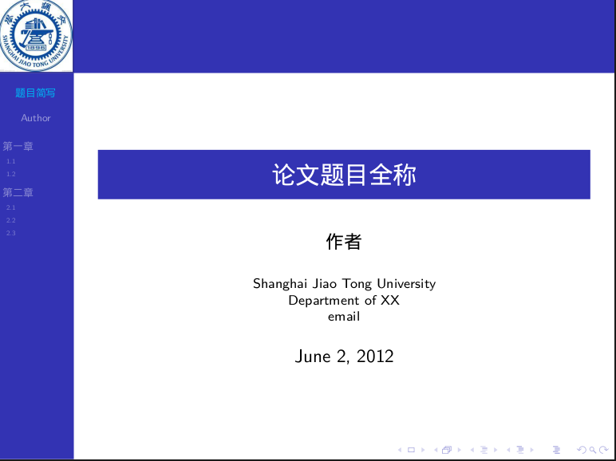

#交大beamer模板

参考自[Yixf’s blog](http://yixf.name/2011/06/21/%E4%BD%BF%E7%94%A8xetex%E7%9A%84beamer%E6%A8%A1%E7%89%88/), 我只是修改了一下主题, 换了一下交大的图标, 并且做了一些常用功能的例子...

效果截图:

 
**注意**

1. 使用xelatex编译生成, latex估计不行;

2. 编辑内容直接修改beame_body.tex即可, 改变设置一般在beamer_header.tex里

3. 我用的是文泉驿的字体, 可以修改beamer_header.tex改变字体设置, 查看已安装的中文字体的命令为: `fc-list :lang=zh-cn`

4. 个人一点感觉: 用tex写ppt有时也会因为少些括号或者什么地方没注意老师编译不过, 所以用tex写也不一定能比用powerpoint方便, 不论啥工具, 只要能**get things done**,就是好工具~
